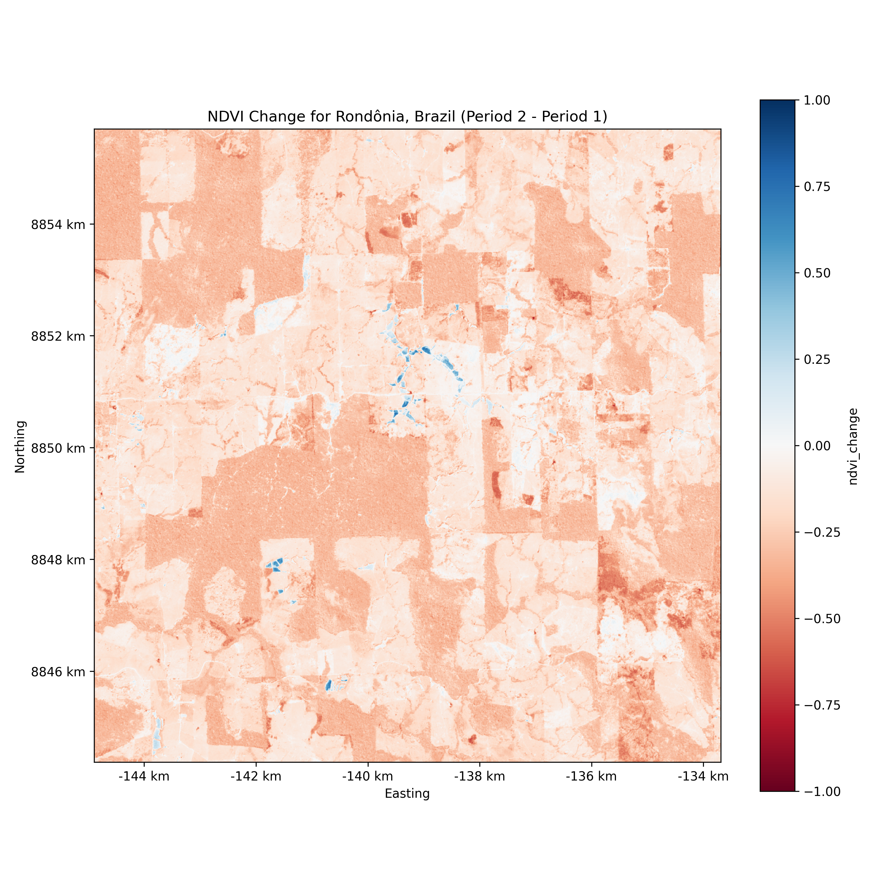
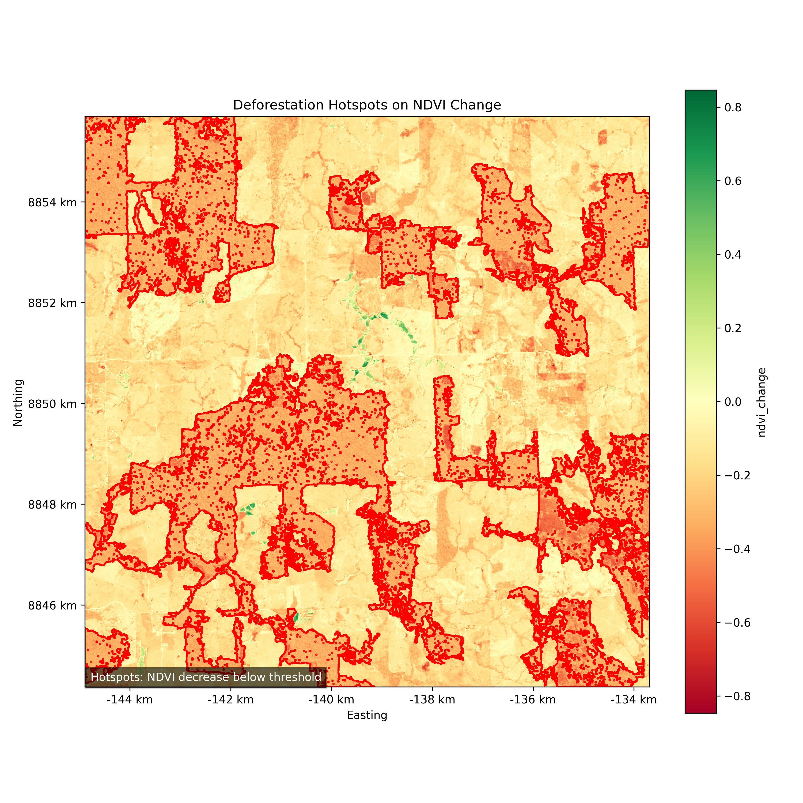
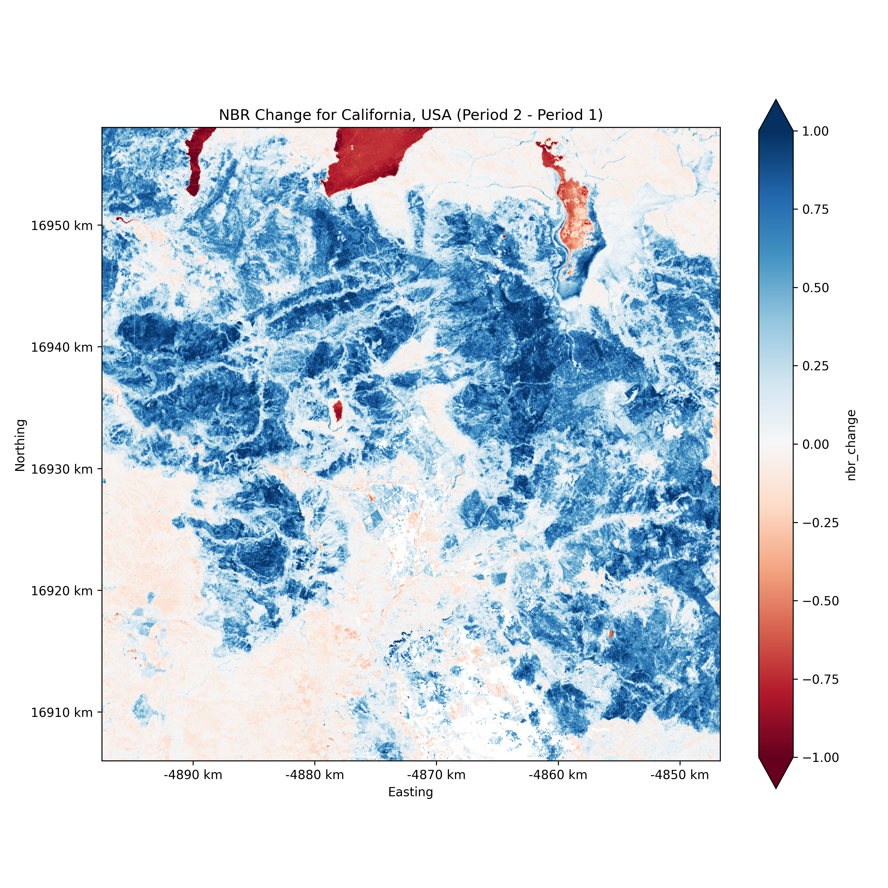
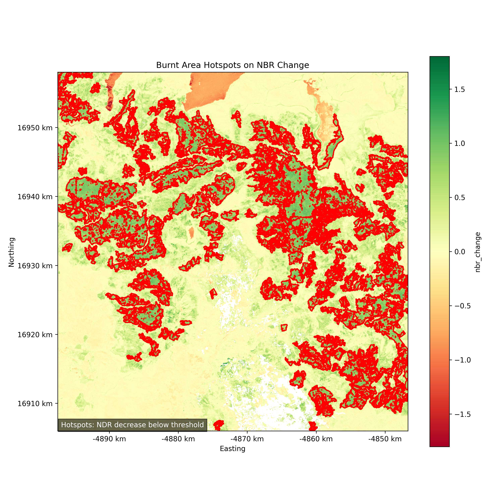

# 🌍 Geospatial Change Detection Pipeline

A production-style geospatial Python project for detecting real-world environmental change using multi-temporal Sentinel-2 satellite imagery.

This repository demonstrates two applied remote sensing workflows:

- 🌳 **Deforestation detection** in Rondônia (Brazil, Amazon)
- 🔥 **Burned area detection** using the Dixie Fire (California, USA)

The pipeline goes beyond simple raster subtraction by incorporating multi-scene compositing, cloud masking, and spatial filtering to produce clean, GIS-ready outputs.

---

## 🚀 Example Results

### 🌳 Deforestation (Rondônia, Brazil)
  


👉 Clear rectangular patterns reflect real-world deforestation driven by human land clearing.

---

### 🔥 Burned Area (Dixie Fire, California – 2021)
  


👉 Large contiguous clusters represent high-confidence burn scars after wildfire events.

---

## 💡 What this project demonstrates

- Multi-temporal satellite analysis using Sentinel-2 imagery  
- Detection of different environmental phenomena using appropriate indices:
  - **NDVI** → vegetation loss (deforestation)
  - **NBR / dNBR** → burn severity (wildfires)
- Robust preprocessing using multi-scene compositing and cloud masking  
- Conversion from raster-based change detection → vector GIS outputs  
- Handling real-world data challenges:
  - clouds
  - atmospheric noise
  - terrain-induced artifacts

---

## 🌳 Deforestation Detection (Rondônia, Brazil)

This pipeline detects vegetation loss hotspots in the Amazon rainforest.

### Method:
- Compute **NDVI** for two equivalent seasonal windows
- Filter for areas with sufficient initial vegetation
- Detect **significant NDVI decrease**
- Remove small noisy patches using area thresholds
- Export results as GeoJSON polygons

### Key idea:
> Compare **equivalent seasonal windows across years** to isolate real deforestation from natural vegetation cycles.

---

## 🔥 Burned Area Detection (Dixie Fire, California)

This pipeline detects wildfire impact using spectral burn indices.

### Method:
- Compute **NBR** (Normalized Burn Ratio) for:
  - pre-fire vegetation period
  - post-fire conditions
- Calculate:

`dNBR = NBR_pre - NBR_post`

- Filter for areas that:
- had vegetation before (pre-NBR threshold)
- show strong positive dNBR (burn signal)
- Remove small artifacts and vectorize results

### Key idea:
> Burn detection relies on **abrupt spectral change**, not gradual vegetation variation.

---

## 🧠 Methodology & Design Decisions

### Why multi-scene compositing matters

Single satellite scenes are unreliable due to:
- clouds
- shadows
- atmospheric variation

This pipeline:
- retrieves multiple scenes per time window
- applies cloud masking (SCL band)
- builds a **median composite**

→ resulting in a stable, cloud-free representation

---

### Why equivalent seasonal windows matter

Vegetation varies naturally throughout the year.

Comparing different seasons would:
- falsely indicate vegetation loss
- distort NDVI-based analysis

→ this pipeline compares **same-season windows across time**

---

### Why thresholding alone is not enough

Raw index differences contain:
- terrain effects
- illumination changes
- noise

This pipeline improves reliability by combining:
- **initial vegetation filtering**
- **change magnitude thresholds**
- **minimum area constraints**

→ resulting in clean, interpretable hotspots

---

## 🏗 Pipeline Overview

1. **AOI Ingestion** – Load GeoJSON area of interest  
2. **Data Fetching** – Query Sentinel-2 scenes via STAC API  
3. **Preprocessing** – Cloud masking + median compositing  
4. **Index Calculation** – NDVI or NBR  
5. **Change Detection** – Compute NDVI difference or dNBR  
6. **Thresholding** – Identify meaningful change  
7. **Noise Removal** – Remove small isolated regions  
8. **Vectorization** – Convert raster mask → GeoJSON  
9. **Reporting** – Generate statistics and visual outputs  

---

## 📁 Project Structure

```text
qgis-python-miniproject/
├── data/
│   └── raw/                    # AOIs (GeoJSON)
├── outputs/
│   ├── figures/               # Visualizations (PNG)
│   ├── rasters/               # Raster outputs (GeoTIFF)
│   ├── reports/               # Summary statistics
│   └── vectors/               # Final GeoJSON results
├── scripts/
│   └── run_*.py               # Pipeline entry points
├── src/
│   └── geospatial_change_detection/
│       ├── core/              # IO, compositing, vectorization
│       ├── indices/           # NDVI, NBR, change logic
│       ├── pipelines/         # Workflow orchestration
│       ├── reports/           # Summary generation
│       └── config.py          # Thresholds & parameters
├── tests/
├── requirements.txt
└── README.md